# Procesverslag
Markdown is een simpele manier om HTML te schrijven.  
Markdown cheat cheet: [Hulp bij het schrijven van Markdown](https://github.com/adam-p/markdown-here/wiki/Markdown-Cheatsheet).

Nb. De standaardstructuur en de spartaanse opmaak van de README.md zijn helemaal prima. Het gaat om de inhoud van je procesverslag. Besteedt de tijd voor pracht en praal aan je website.

Nb. Door *open* toe te voegen aan een *details* element kun je deze standaard open zetten. Fijn om dat steeds voor de relevante stuk(ken) te doen.

## Jij

uitwerken voor kick-off werkgroep

### Auteur:
Daniël Vink

#### Je startniveau:
Rood

#### Je focus:
De focus zal liggen op de surface plane. Echter ga ik zoveel mogelijk proberen de website responsive te maken.
 

## Je website

uitwerken voor kick-off werkgroep

### Je opdracht:
https://dierenparkamersfoort.nl/

#### Screenshot(s) van de eerste pagina (small screen): 
hier de naam van de pagina  
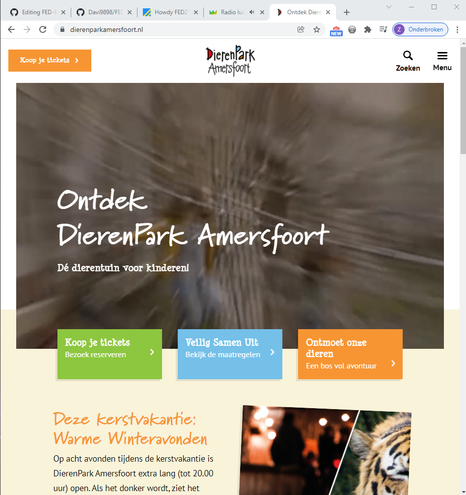

#### Screenshot(s) van de tweede pagina (small screen):
hier de naam van de pagina  
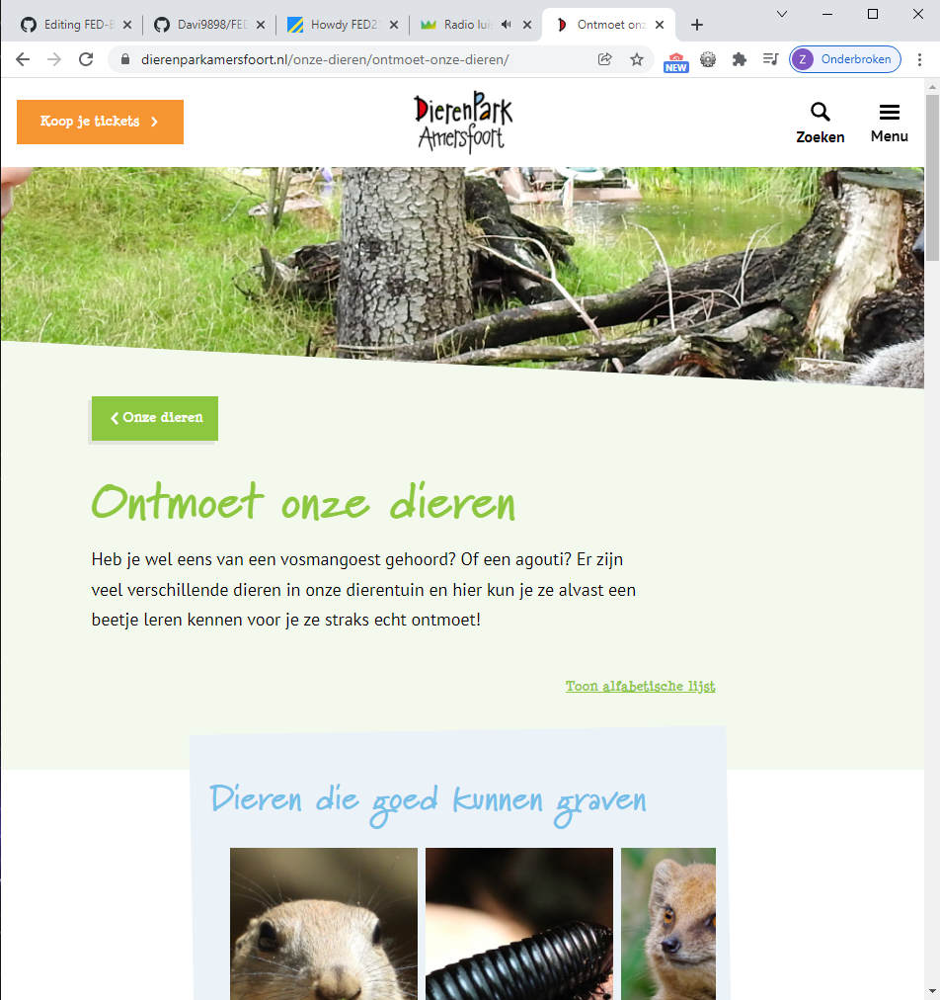
 

## Breakdownschets (week 1)

uitwerken na afloop 2e werkgroep

De website kleineert bij 1200px width 992px width 768px width
### de hele pagina:
1200px
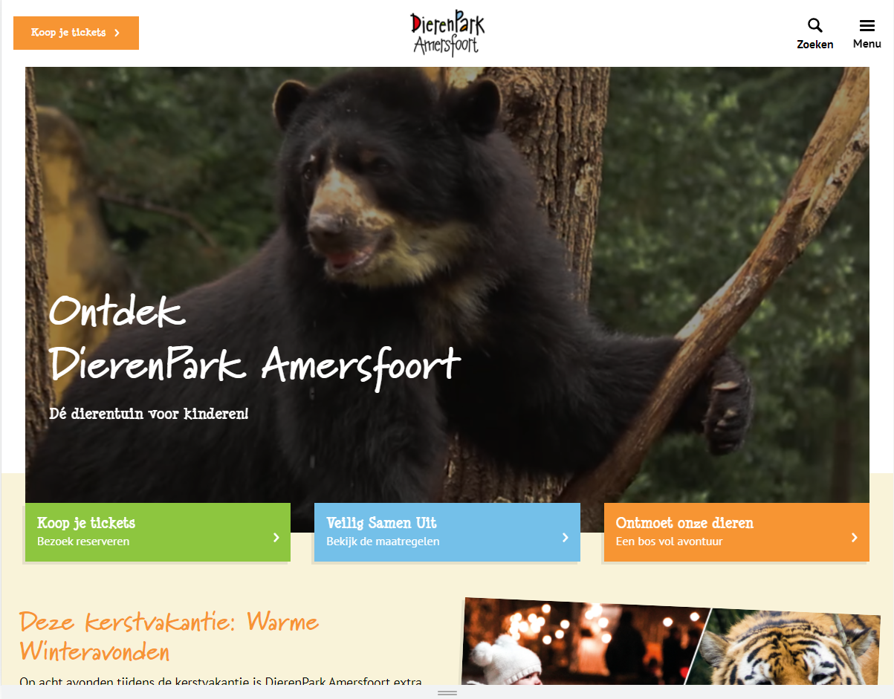
992px
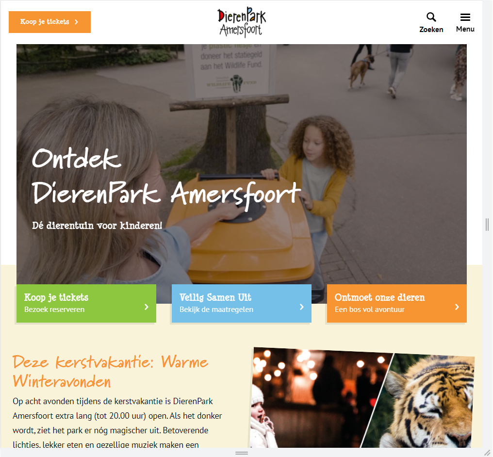
768px
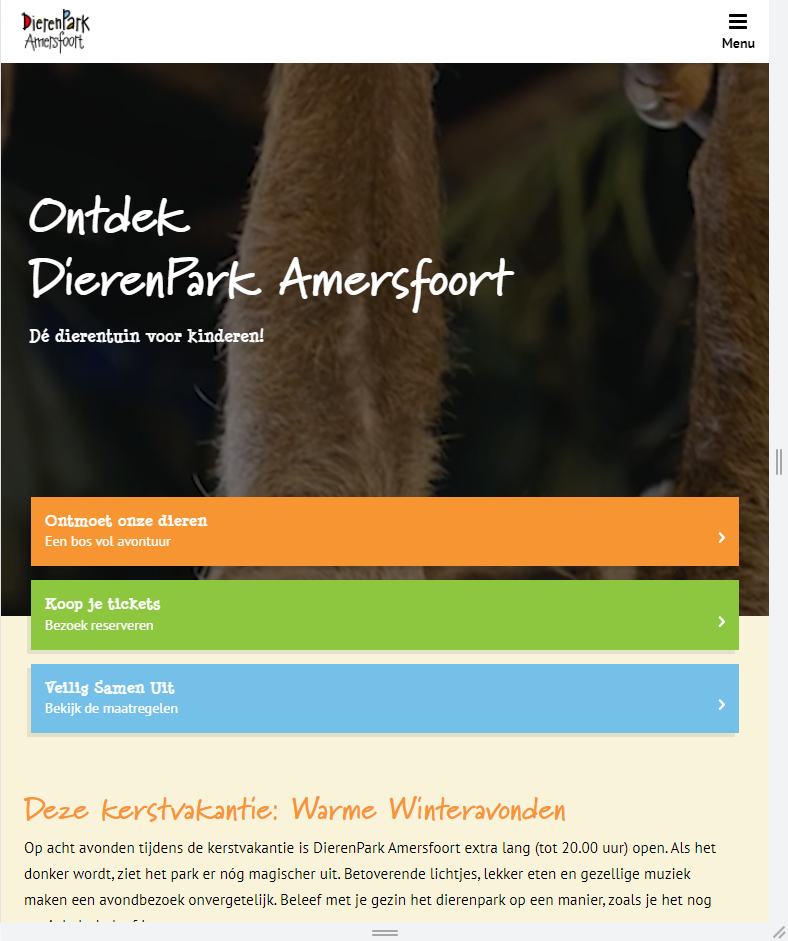
### dynamisch deel (bijv menu): 
 
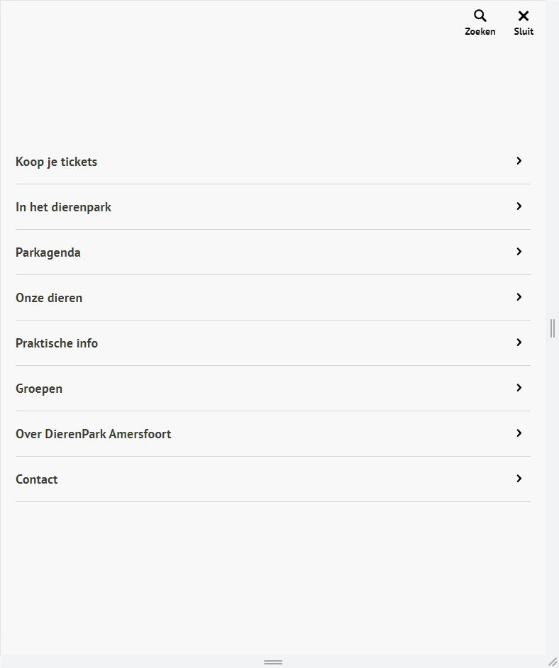
1200px menu
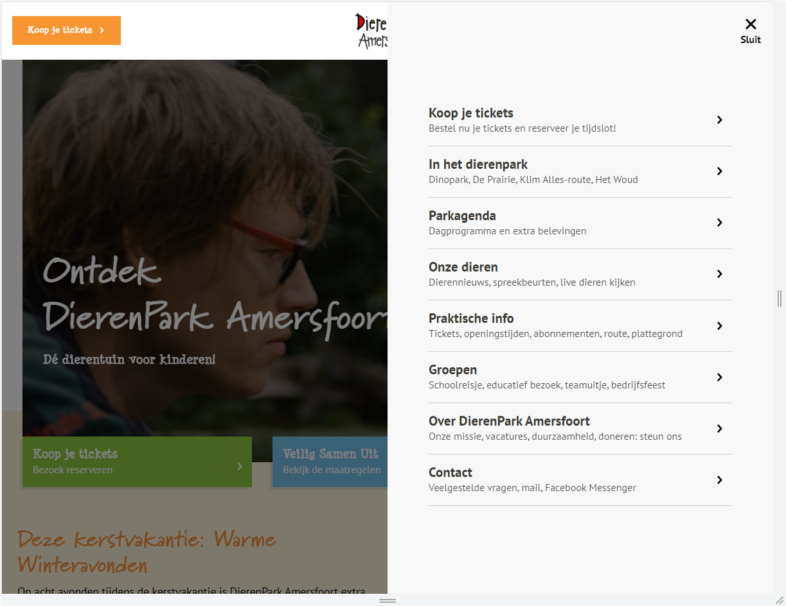
 
Hier twee schetsen van wanneer de website een breakdownpoint bereikt.
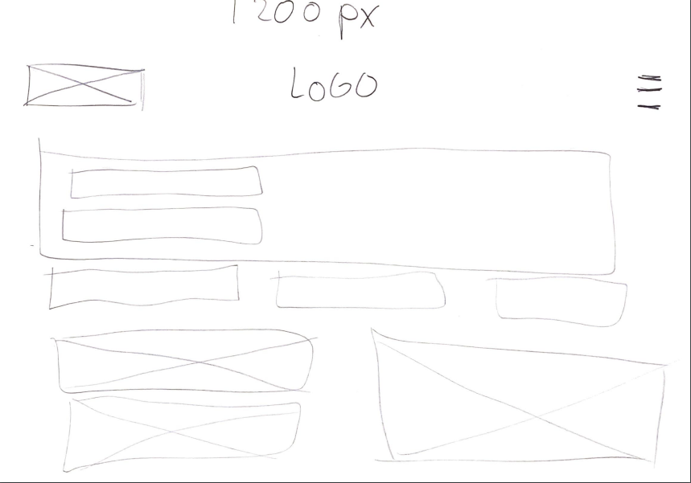

## Voortgang 1 (week 2)

uitwerken voor 1e voortgang

### Stand van zaken
Ik vond het positioneren soms wel lastig. Het werkte soms gewoon niet. Ook heb ik veel moeite gehad met die media query. Om te begrijpen waarom de button bij 768 opeens verwdijnt. Maar dat werd dus met een media query gedaan.

### Agenda voor meeting
samen met je groepje opstellen

| Daniël     | student 2          | student 3    | student 4        |
| ---            | ---                | ---          | ---              |
| ik heb geen vragen | dit als er tijd is | nog een punt | dit wil ik zeker |
| ...            | ...                | ...          | ...              |

### Verslag van meeting
hier na afloop snel de uitkomsten van de meeting vastleggen

- HTML opmaken
- Niet te ver vooruitlopen.

## Voortgang 2 (week 3)

uitwerken voor 2e voortgang

### Stand van zaken
Ik ben niet super erg opgeschoten deze week door omstandigheden. Ik moet nog flink aan de slag om alles af te krijgen.

### Agenda voor meeting
samen met je groepje opstellen

| Daniël     | student 2          | student 3    | student 4        |
| ---            | ---                | ---          | ---              |
| Ik heb geen vragen | dit als er tijd is | nog een punt | dit wil ik zeker |
| ...            | ...                | ...          | ...              |

### Verslag van meeting
hier na afloop snel de uitkomsten van de meeting vastleggen

Minder focussen op het responsive maken van de website want dit kost veel tijd. Focussen op de surface van de website.

## Toegankelijkheidstest (week 4)

uitwerken na test in 8e voortgang

### Bevindingen
Lijst met je bevindingen die in de test naar voren kwamen:
 - Menu niet toegankelijk voor een screenreader
 - Er misten veel alt tags binnen mijn HTML
 - De kleurcontrast is goed.
 - De website is toegankelijk voor mensen met Parkinson.

#### Titel eerste bevinding
Hier korte omschrijving (met indien nodig een afbeelding)

Het menu moet toegankelijk gemaakt worden voor de screen reader. Dit moet zo gedaan worden dat het menu een element wordt die geselecteerd kan worden. Op mijn website is dit nog niet het geval.

#### Titel tweede bevinding. 
Hier korte omschrijving (met indien nodig een afbeelding)

Er waren heel veel alt tags die ontbreekte binnen mijn HTML. Hierdoor konden de afbeeldingen niet worden voorgelezen waardoor het niet duidelijk was voor mensen die een screenreader gebruikte.

#### Titel volgende bevinding. 
Hier korte omschrijving (met indien nodig een afbeelding)

Door gebruik te maken van de verschillende brillen die aanwezig waren en deze te hebben getest

#### Titel nog een bevinding. 
Hier korte omschrijving (met indien nodig een afbeelding)

Hier een omschrijving van hoe het opgelost kan worden (met indien nodig een afbeelding)

## Voortgang 3 (week 4)

uitwerken voor 3e voortgang

### Stand van zaken
De stand van zaken is dat ik nog heel veel classes en div's gebruik. Dit mag echter niet waardoor ik dit nog moet gaan aanpassen.

### Agenda voor meeting
samen met je groepje opstellen

| student 1      | student 2          | student 3    | student 4        |
| ---            | ---                | ---          | ---              |
| Vragen of divs | en dit             | en ik dit    | en dan ik dat    |
| mogen en classes| dit als er tijd is | nog een punt | dit wil ik zeker |
| ...            | ...                | ...          | ...              |

### Verslag van meeting
hier na afloop snel de uitkomsten van de meeting vastleggen

Alle classes en divs wegwerken is wat ik nog moet doen. En de rest van de website afmaken, ook nog door de W3C validator halen.

## Eindgesprek (week 5)

uitwerken voor eindgesprek

### Stand van zaken
Ik ben tevreden met het eindresultaat wat ik heb mogen behalen. Na veel te hebben gestruggled ben ik toch terecht gekomen waar ik terecht wilde komen. Het is helaas niet gelukt om de website responsive te maken omdat hier heel veel tijd in ging zitten. En ik was al heel veel tijd kwijt aan het maken van de surface van de website.

### Screenshot(s)

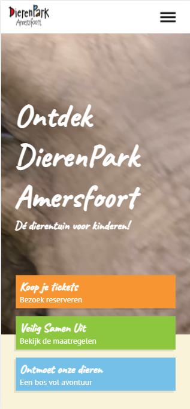
 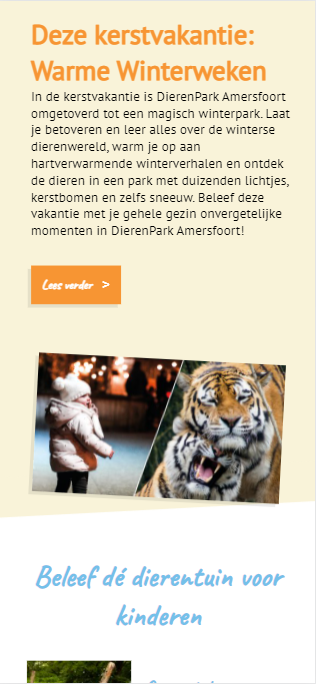
 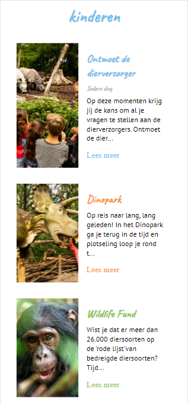
 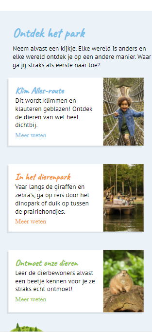
 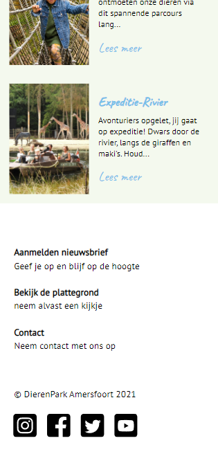
 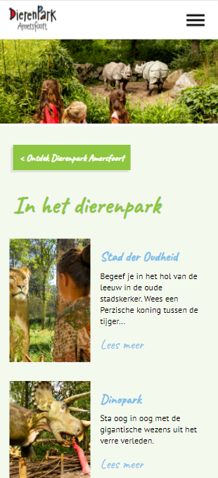

## Bronnenlijst

continu bijhouden terwijl je werkt

Nb. Wees specifiek ('css-tricks' als bron is bijv. niet specifiek genoeg).

1. https://www.youtube.com/watch?v=zGiirUiWslI
2. https://www.youtube.com/watch?v=OtBpgtqrjyo
3. https://www.w3schools.com/cssref/sel_before.asp
4. https://www.w3schools.com/howto/howto_css_cards.asp
5. https://css-tricks.com/currentcolor/
6. https://developer.mozilla.org/en-US/docs/Web/CSS/aspect-ratio

