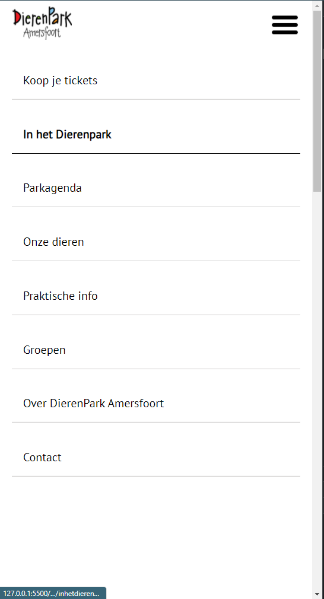
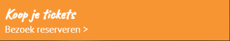
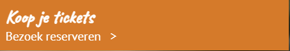

## Ik

### Auteur:
Daniël Vink

#### Je startniveau:
Rood

#### Je focus:
Bij deze website leg ik de focus neer op de surface plane
 

## Je website

### Je opdracht:
https://dierenparkamersfoort.nl/

#### Screenshot(s) van de eerste pagina (small screen): 
hier de naam van de pagina  

#### Screenshot(s) van de tweede pagina (small screen):
hier de naam van de pagina  

 

## Breakdownschets (week 1)

De website kleineert bij 1200px width 992px width 768px width
### de hele pagina:
1200px

992px

768px

### dynamisch deel (bijv menu): 
 

1200px menu

 
Hier twee schetsen van wanneer de website een breakdownpoint bereikt.

## Voortgang 1 (week 2)

### Stand van zaken
Ik vond het positioneren soms wel lastig. Het werkte soms gewoon niet. Ook heb ik veel moeite gehad met die media query. Om te begrijpen waarom de button bij 768 opeens verwdijnt. Maar dat werd dus met een media query gedaan.

### Agenda voor meeting
samen met je groepje opstellen

| Daniël     | student 2          | student 3    | student 4        |
| ---            | ---                | ---          | ---              |
| ik heb geen vragen | dit als er tijd is | nog een punt | dit wil ik zeker |
| ...            | ...                | ...          | ...              |

### Verslag van meeting
hier na afloop snel de uitkomsten van de meeting vastleggen

- HTML opmaken
- Niet te ver vooruitlopen.

## Voortgang 2 (week 3)

### Stand van zaken
Ik ben niet super erg opgeschoten deze week door omstandigheden. Ik moet nog flink aan de slag om alles af te krijgen.

### Agenda voor meeting
samen met je groepje opstellen

| Daniël     | student 2          | student 3    | student 4        |
| ---            | ---                | ---          | ---              |
| Ik heb geen vragen | dit als er tijd is | nog een punt | dit wil ik zeker |
| ...            | ...                | ...          | ...              |

### Verslag van meeting
hier na afloop snel de uitkomsten van de meeting vastleggen

Minder focussen op het responsive maken van de website want dit kost veel tijd. Focussen op de surface van de website.

## Toegankelijkheidstest (week 4)

Tijdens de 8e werkgroep zijn wij als klas een toegangkelijkheids test gaan ondernemen. Deze als functie om er achter te komen wat de toegangkelijkheid is van de huidige status van onze website. 

### Bevindingen
Lijst met bevindingen die ik heb gevonden:
 - Menu niet toegangkelijk voor een screenreader
 - Er misten veel alt tags binnen mijn HTML
 - het kleurcontrast is goed.
 - De website is toegankelijk voor mensen met Parkinson.
 - De verandering van kleur tijdens hoveren maakt interactieve elementen zichtbaar voor slechtzienden.

#### Menu niet toegangkelijk voor een screenreader

Op dit moment kan een screenreader nog niet optimaal werken op mijn website. De website is nog niet zo optimaal geprogrammeerd dat de screenreader deze goed kan lezen. Een voorbeeld hiervan is het menu. Deze kan niet worden opengeklapt waardoor een blind persoon die een screenreader gebruikt deze nooit zou kunnen gebruiken. De screenreader vind het element ook niet. Hier zal ik in de toekomst een verandering in gaan brengen.

#### Er missen alt tags

Tijdens het gebruiken van de screenreader ben ik erachter gekomen dat er veel alt tags ontbraken in mijn code. Dit zorgde ervoor dat een screenreader geen idee heeft wat er afgebeeld staat in een afbeelding. Hierdoor weet de gebruiker van een screenreader ook niet wat er afspeelt wat niet gebruikersvriendelijk is. Ik heb dit zo snel mogelijk aangepast. 

#### Het kleurcontrast is goed

Tijdens de les heb ik gebruik gemaakt van de aanwezige brillen. Door deze brillen te gebruiken ben ik erachter gekomen dat de verschillende elementen op mijn website goed te onderscheiden zijn van elkaar. Ook wanneer er sprake is van een wazig beeld of kleurenblindheid.

#### Website toegankelijk voor mensen met Parkinson 

Tijdens de les heb ik gebruik gemaakt van het apparaat wat je arm deed trillen. De website was vrijwel goed te besturen met het parkinson naboots apparaat. Echter waren alleen de kleine 'Lees meer' buttons iets moeilijker om aan te klikken. Dit maakt het misschien iets moeilijker maar het is voor alsnog goed te doen.

 
#### Verandering kleur interactieve elementen 

Door dat de kleur verandert van de meeste interactieve elementen is het voor slechtzienden gemakkelijker gemaakt om te herkennen wanneer een element interactief is. Dit zal ik onthouden om later ook toe te passen.
 
#### Conclusie

Mijn website is niet toegankelijk voor screenreaders. Dit zal ik in de toekomst nog moeten gaan verbeteren zodat dit ook toegankelijk is voor mensen met een beperking zoals blindheid. Wel kunnen mensen die wat slechter zien mijn website goed gebruiken en ook mensen met Parkinson. Echter denk ik dat het optimaal maken van een screenreader nog best complex kan zijn en ik moet hier dus ook nog veel over leren. Maar daar heb ik de tijd ook nog voor.

## Voortgang 3 (week 4)

### Stand van zaken
De stand van zaken is dat ik nog heel veel classes en div's gebruik. Dit mag echter niet waardoor ik dit nog moet gaan aanpassen.

### Agenda voor meeting
samen met je groepje opstellen

| student 1      | student 2          | student 3    | student 4        |
| ---            | ---                | ---          | ---              |
| Vragen of divs | en dit             | en ik dit    | en dan ik dat    |
| mogen en classes| dit als er tijd is | nog een punt | dit wil ik zeker |
| ...            | ...                | ...          | ...              |

### Verslag van meeting
hier na afloop snel de uitkomsten van de meeting vastleggen

Alle classes en divs wegwerken is wat ik nog moet doen. En de rest van de website afmaken, ook nog door de W3C validator halen.

## Eindgesprek (week 5)

### Stand van zaken
Ik ben tevreden met het eindresultaat wat ik heb mogen behalen. Na veel te hebben gestruggled ben ik toch terecht gekomen waar ik terecht wilde komen. Het is helaas niet gelukt om de website responsive te maken omdat hier heel veel tijd in ging zitten. En ik was al heel veel tijd kwijt aan het maken van de surface van de website.

### Screenshot(s)

 
 
 
 
 

## Eindgesprek 2(week 6)

 
 
### Stand van zaken.
Ik heb deze weken hard gewerkt aan een nieuwe iteratie van mijn website. Ik moest nog enkele elementen toevoegen zoals states aan mijn buttons. Ik heb nu alle buttons interactief gemaakt waardoor de website echt tot leven komt. Wel zo prettig voor de gebruiker. Ook heb ik mijn verslag opgeknapt en nu ik nog wat interactieve elementen erbij heb gekregen. Zelf geprobeerd of deze toegankelijk genoeg zijn voor groepen die er problemen mee zouden kunnen ervaren.
 
Hier is het navigatie element te zien waar nu een hover state op zit.
 
In de volgende afbeelding wordt weergegeven hoe de buttons een diepere kleur krijgen en een pijltje wat beweegt. Dit maakt het voor de gebruiker duidelijk dat het een interactief element is.
 
Dit geldt echter voor alle interactieve elementen, behalve het logo en de social media.
 

#### Bronnenlijst

1. https://www.youtube.com/watch?v=zGiirUiWslI
2. https://www.youtube.com/watch?v=OtBpgtqrjyo
3. https://www.w3schools.com/cssref/sel_before.asp
4. https://www.w3schools.com/howto/howto_css_cards.asp
5. https://css-tricks.com/currentcolor/
6. https://developer.mozilla.org/en-US/docs/Web/CSS/aspect-ratio

